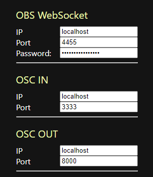
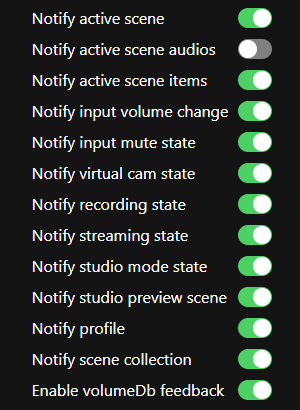

# OSC for OBS

> **Note**  
> This is a forked repository of [jshea2/OSC-for-OBS](github.com/jshea2/OSC-for-OBS) being (heavily) modified to personal preference, which make it *not* compatible with upstream (function, versioning, etc.). 
> If you found a bug or have any suggestion for this repo, please put it [here](https://github.com/Re-Alise/OSC-for-OBS/issues).

> This software is in **WIP** state, with incompleted functions, inconsistent behaviour and/or critical bugs, please try it throughly in a test environment first if you would like to use it anywhere else

<p align="center">
  
</p>

Control and listen to [OBS Studio](https://obsproject.com/) via [OSC](https://en.wikipedia.org/wiki/Open_Sound_Control) protocol.

This is an Electron app that let you control OBS Studio via obs-websocket and your favorite OSC clients.

## Requirement

- [OBS Studio](https://obsproject.com) 27.0.0 or above
- [obs-websocket](https://github.com/obsproject/obs-websocket) **5.0.0** or above  
  OBS Studio 28.0 and above already have obs-websocket built-in, you don't need to download it separately
- An OSC client

## Scene and Source Naming

To prevent unexpected behaviour, it's recommended to avoid the use of following names for your scenes/sources/filters/profiles/scene collections (case sensitive):

- current

- transform

- enable

- disable

- Any other names that contains slash(`/`)

While white space, symbols and non-ascii characters works fine so far in my testing, if you encountered any issue, please try renaming them to ascii characters and replace white space with underscore `_` or dash `-`

## Basic Settings



- OBS WebSocket  
  The IP, port and password of the obs-websocket to connect to

- OSC IN  
  The IP and port of OSC client to receive command messages from

- OSC OUT  
  The IP and port of OSC client to send feedback messages to

## OSC Commands

An OSC message is consist of address and arguments, by sending them, you can control various part of OBS Studio. For example:

| Address | Arguments | Description
|---|---|---|
| /scene | "Scene 2" | Set current scene to "Scene 2"
| /recording | 1 | Start recording
| /recording | 0 | Stop recording
| /sceneItem/Browser/transform/cropTop | 100 | Set crop top to `100` for `Browser`
| /transition/current | "Fade" | Set scene transition to `Fade` (not transition override)
| /studio/transition | 1 | Start transition (when studio mode enabled)
| /studio/transition | "Cut" | Start transition with transition named `Cut` (when studio mode enabled)
| /studio/transition | "Fade" 500 | Start transition with transition named `Fade` and with duration `500` ms (when studio mode enabled)

> See [here](docs/osc_commands.md) for complete list

## OSC Feedbacks

When certain event triggered in OBS Studio, OSC for OBS would also send feedback if related toggle is enabled in settings.



For example, if `Notify active scene` is enabled, when you switch a scene in OBS Studio, the following OSC messages would be sent to OSC client

| Address | Arguments | Description
|---|---|---|
| /activeScene | "Scene 3" | Feedback the name of scene is switching to (at the start of transition)
| /activeSceneCompleted | "Scene 3" | Feedback the name of scene is switched to (at the end of transition)

> See [here](docs/osc_feedbacks.md) for complete list

## Development

You can run dev version of OSC for OBS by:

```shell
npm install # First time only, install all required dependencies
npm start
```

> See [here](docs/development.md) for more information

## Acknowledgement

- [OSC for OBS by jshea2](github.com/jshea2/OSC-for-OBS) - Original project (upstream)
- [ObSC](https://github.com/CarloCattano/ObSC) - This project is inspired by
