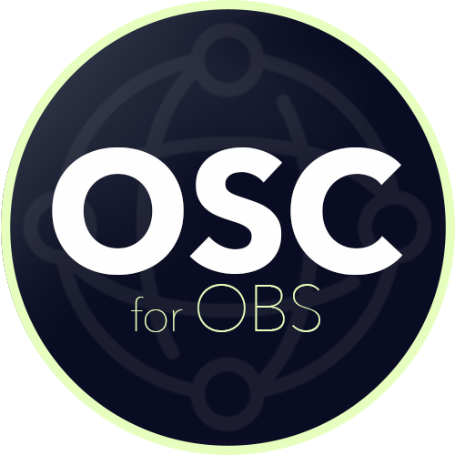

# OSC for OBS

> **Note**  
> This is a forked repository of [jshea2/OSC-for-OBS](github.com/jshea2/OSC-for-OBS) being (heavily) modified to personal preference, which make it *not* compatible with upstream (function, versioning, etc.). 
> If you found a bug or have any suggestion for this repo, please put it [here](https://github.com/Re-Alise/OSC-for-OBS/issues).

> This software is in **WIP** state, with incompleted functions, inconsistent behaviour and/or critical bugs, please try it throughly in a test environment first if you would like to use it anywhere else

<p align="center">
  
</p>

Control and listen to [OBS](https://obsproject.com/) via OSC protocol

# Requirement

- [OBS Studio](https://obsproject.com) 27.0.0 or above
- [obs-websocket](https://github.com/obsproject/obs-websocket) **5.0.0** or above

# Scene and Source Naming

To prevent unexpected behaviour, it's recommended to avoid the use of following names for your scenes/sources (case sensitive):

- transform

- enable

- disable

While white space, symbols and non-ascii characters works fine so far in my testing, if you encountered any issue, please try renaming them to ascii characters and replace white space with underscore `_` or dash `-`

# OSC Command List (WIP)

Format: `[command address(path)]` `argument 1` `argument 2` ... `argument n`

> If a command could be triggered by multiple addresses, only the first (top) one would received the feedback.

> Example: Get active state of scene `Scene 1` by sending `/source` `Scene 1` would still getting feedback from `/source/Scene 1/active`

## Scene

`/scene`

Get scene list

`/activeScene`

Get currently active scene

`/activeScene` `[scene name]` or

`/scene` `[scene name]` or

`/scene` `[scene index (0~n-1)]` or

`/scene/[scene name]` `1` or

`/scene/[scene index (0~n-1)]` `1`

Set currently active scene

## Source

`/source`

Get source list (scenes + inputs)

`/source` `[source name]` or

`/source/[source name]/active`

Get active state (shown on screen or not) of source

`/source/[source name]/filters`

Get filter list of the source

`/source/[source name]/filters/[filter name]` or

`/source/[source name]/filters/[filter name]/enable`

Get enable state of the filter

`/source/[source name]/filters/[filter name]` `[0|1]` or

`/source/[source name]/filters/[filter name]/enable` `[0|1]`

Set enable state of the filter

`/source/[source name]/filters/[filter name]/disable`

Disable the filter

`/source/[source name]/filters/[filter name]/settings`

Get list of path of available settings for the filter

`/source/[source name]/filters/[filter name]/settings/[path of setting]`

Get current value of the filter setting

`/source/[source name]/filters/[filter name]/settings/[path of setting]` `[setting value]`

Set current value of the filter setting

`/source/[source name]/filters/[filter name]/reset`

Reset filter settings and enable it

## Scene Item
 
`/sceneItem`

Get scene item list of current scene

`/sceneItem` `[scene name]`

Get scene item list of specific scene

`/sceneItem/[path to scene item]/enable`

Get enable state of the scene item

`/sceneItem/[path to scene item]/enable` `[0|1]`

Set enable state of the scene item

`/sceneItem/[path to scene item]/disable` `1`

Disable the scene item

`/sceneItem/[path to scene item]/transform`

Get transform/crop info (attributes) of a scene item

- width, height (Read only)  
  Current source size when bounding box type is set to `No bounds`

- sourceWidth, sourceHeight (Read only)  
  Source's original size

- positionX, positionY

- scaleX, scaleY

- cropTop, cropRight, cropBottom, cropLeft

- rotation (degree)

- alignment  
  Alignment for source or for bounding box when enabled, default: `5` (Top Left)
  <table>
    <tr>
      <td>5 (Top Left)</td>
      <td>4 (Top Center)</td>
      <td>6 (Top Right)</td>
    </tr>
    <tr>
      <td>1 (Center Left)</td>
      <td>0 (Center)</td>
      <td>2 (Center Right)</td>
    </tr>
    <tr>
      <td>9 (Bottom Left)</td>
      <td>8 (Bottom Center)</td>
      <td>10 (Bottom Right)</td>
    </tr>
  </table>

- boundsAlignment  
  Alignment for source inside a bounding box, default: `0` (`Center`)

- boundsWidth, boundsHeight

- boundsType  
  Bounding box type, default: `OBS_BOUNDS_NONE` (No bounds)
  - `OBS_BOUNDS_NONE` (No bounds)
  - `OBS_BOUNDS_STRETCH` (Stretch to bounds)
  - `OBS_BOUNDS_SCALE_INNER` (Scale to inner bounds)
  - `OBS_BOUNDS_SCALE_OUTER` (Scale to outer bounds)
  - `OBS_BOUNDS_SCALE_TO_WIDTH` (Scale to width of bounds)
  - `OBS_BOUNDS_SCALE_TO_HEIGHT` (Scale to height of bounds)
  - `OBS_BOUNDS_MAX_ONLY` (Maximum size only)

`/sceneItem/[path to scene item]/transform/[transform attribute]`

`/sceneItem/[path to scene item]/transform/[transform attribute]` `[attribute value]`

### Note - Resizing a source (scene item)

By default, bounding box type of a source is set to `No bounds` . To properly resize a source, you can either stick to No bounds then change the scale of it, or switch to `Stretch to bounds` then change the bounding box size.

#### Example

With a OBS canvas (output) resolution of 1920x1080, a scene `Scene 1` and a image source `Image` contained a 4K image (3840x2160):

If we want to fit `Image` entirely into `Scene 1` , we can either change the scale by

```
'/sceneItem/Scene 1/Image/transform/scaleX' 0.5
'/sceneItem/Scene 1/Image/transform/scaleY' 0.5
```

Or switch bounding box type to `Stretch to bounds` then change the bounding box size, which you can precisely set

```
'/sceneItem/Scene 1/Image/transform/boundsType' 'OBS_BOUNDS_STRETCH'

'/sceneItem/Scene 1/Image/transform/boundsWidth' 1920
'/sceneItem/Scene 1/Image/transform/boundsHeight' 1080
```

## Input

`/input`

Get input list

`/input/[input name]/settings`

Get list of path of available settings for the input

`/input/[input name]/settings/[path of setting]`

Get current value of the input setting

`/input/[input name]/settings/[path of setting]` `[setting value]`

Set current value of the input setting

`/input/[input name]/default`

Get list of path of default settings for the input

`input/[input name]/default/[path of setting]`

Get default value of the input setting


## Audio

`/audio`

Get audio input list (including special inputs like PC audio and mic)

`/audio` `[audio input name]`

Get current volume of audio input in both mil and dB, output to `/audio/[audio input name]/volume` and `/audio/[audio input name]/volumeDb`

`/audio/volume`

Get current volume of audio input in *mil*

`/audio/volume` `[audio volume]`

Set current volume of audio input in *mil*

`/audio/volumeDb`

Get current volume of audio input in *dB*

`/audio/volumeDb` `[audio volume]`

Set current volume of audio input in *dB*

`/audio/mute`

Get mute state of audio input

`/audio/mute` `[0|1]`

Set mute state of audio input

`/sceneAudio`

Get audio input list of current scene (including special inputs like PC audio and mic)

## Transition

`/transition`

Get transition list

`/transition/current`

Get current transition name

`/transition/current` `[scene name]`

Set current transition name

`/transition/duration`

Get current transition duration

`/transition/duration` `[duration (ms)]`

Set current transition duration

`/transition/cursor`

Get current progression of transition (0.0~1.0)

## Studio

`/studio`

Get enable state of studio mode

`/studio` `[0|1]` or

`/studio/enable` `[0|1]`

Set enable state of studio mode

`/studio/disable`

Disable studio mode

`/studio/toggle`

Toggle studio mode

`/studio/preview`

Get studio preview scene

`/studio/preview` `[scene name]`

Set studio preview scene

`/studio/transition` `1`

Trigger studio mode transition

`/studio/transition` `[transition name]`

Trigger studio mode transition with specific transition

`/studio/transition` `[transition name]` `[duration (ms)]`

Trigger studio mode transition with specific transition and duration

`/studio/cursor` `[cursor value (0.0~1.0)]`

Set current progression of transition (0.0~1.0)

Note: Unless it's set to 1.0, which will also trigger `/activeSceneCompleted`, you could enter any value within the range.

## Recording

`/recording`

Get recording state, 0 for stopped, 1 for started

`/recording` `[0|1]` or

`/recording/start` `[0|1]`

Set recording state, 0 for stop, 1 for start

`/recording/stop` `1`

Stop recording

`/recording/pause` `[0|1]`

Pause recording, 0 for resume, 1 for pause

`/recording/resume` `1`

Resume recording

`/recording/toggle` `1`

Toggle recording state between start and stop

`/recording/togglePause` `1`

Toggle recording state between pause and resume

## Streaming

`/streaming`

Get streaming state, 0 for stopped, 1 for started

`/streaming` `[0|1]` or

`/streaming/start` `[0|1]`

Set streaming state, 0 for stop, 1 for start

`/streaming/stop` `1`

Stop streaming

`/streaming/toggle` `1`

Toggle streaming state between start and stop

## Virtual Cam

`/virtualCam`

Get virtual cam state, 0 for stopped, 1 for started

`/virtualCam` `[0|1]` or

`/virtualCam/start` `[0|1]`

Set virtual cam state, 0 for stop, 1 for start

`/virtualCam/stop` `1`

Stop virtual cam

`/virtualCam/toggle` `1`

Toggle virtual cam state between start and stop

## Output

> Warning: Untested

`/output`

Get output list (might including virtual cam)

`/output/[output name]` or

`/output` `[output name]`

Get output state, 0 for stopped, 1 for started

`/output/[output name]` `[0|1]` or

`/output/[output name]/start` `[0|1]`

Set output state, 0 for stop, 1 for start

`/output/[output name]/stop` `1`

Stop output

`/output/[output name]/toggle` `1`

Toggle output state between start and stop

# OSC Feedbacks (WIP)

In addition to some commands above, OSC for OBS could also send feedbacks when certain events is triggered in OBS if related option is enabled.

## Scene

`/activeScene` `[scene name]`

Option: Notify active scene

Triggered when OBS is start changing scene

`/activeSceneCompleted` `[scene name]`

Option: Notify active scene

Triggered when a new scene is completely transitioned

## Scene Item

`/sceneItem` `[scene item 1]` ... `[scene item n]`

Option: Notify active scene items

Triggered when a new scene is completely transitioned

## Audio

`/sceneAudio` `[scene audio input 1]` ... `[scene audio input n]`

Option: Notify active scene audios

Triggered when a new scene is completely transitioned

`/audio/[audio input]/volume` `[volume (0.0~1.0)]`

Option: Notify input volume change

Triggered when a audio input's volume is changed in OBS

`/audio/[audio input]/volumeDb` `[volume (-100.0~0.0)]`

Option: Enable volumeDb feedback

Triggered when a audio input's volume is changed in OBS

`/audio/[audio input]/mute` `[0|1]`

Option: Notify input mute state

Triggered when a audio input is unmuted/muted in OBS

## Recording

`/recording` `[0|1]`

Option: Notify recording state

Triggered when recording is stopped/started

`/recording/pause` `[0|1]`

Option: Notify recording state

Triggered when recording is resumed/paused

## Streaming

`/streaming` `[0|1]`

Option: Notify streaming state

Triggered when streaming is stopped/started

## Virtual Cam

`/virtualCam` `[0|1]`

Option: Notify virtual cam state

Triggered when virtual cam is stopped/started

## Studio

`/studio` `[0|1]`

Option: Notify studio mode state

Triggered when studio mode is disabled/enabled in OBS

`/studio/preview` `[scene name]`

Option: Notify studio preview scene

Triggered when preview scene is changed in OBS

# Acknowledgement

- [OSC for OBS by jshea2](github.com/jshea2/OSC-for-OBS) - Original project (upstream)
- [ObSC](https://github.com/CarloCattano/ObSC) - Inspired by this project
